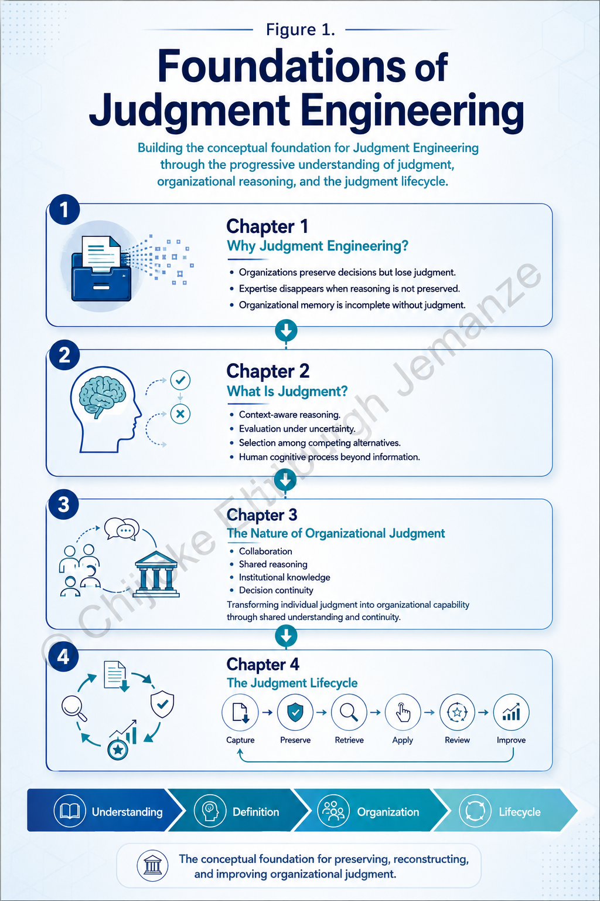
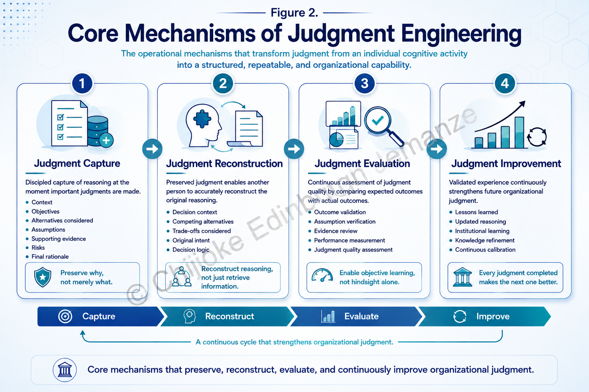
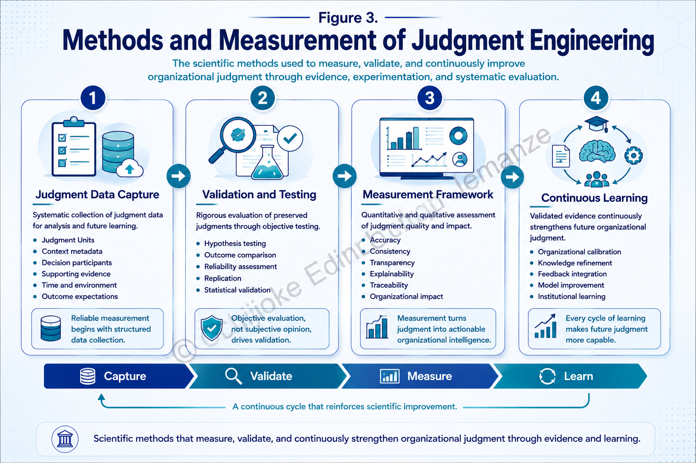
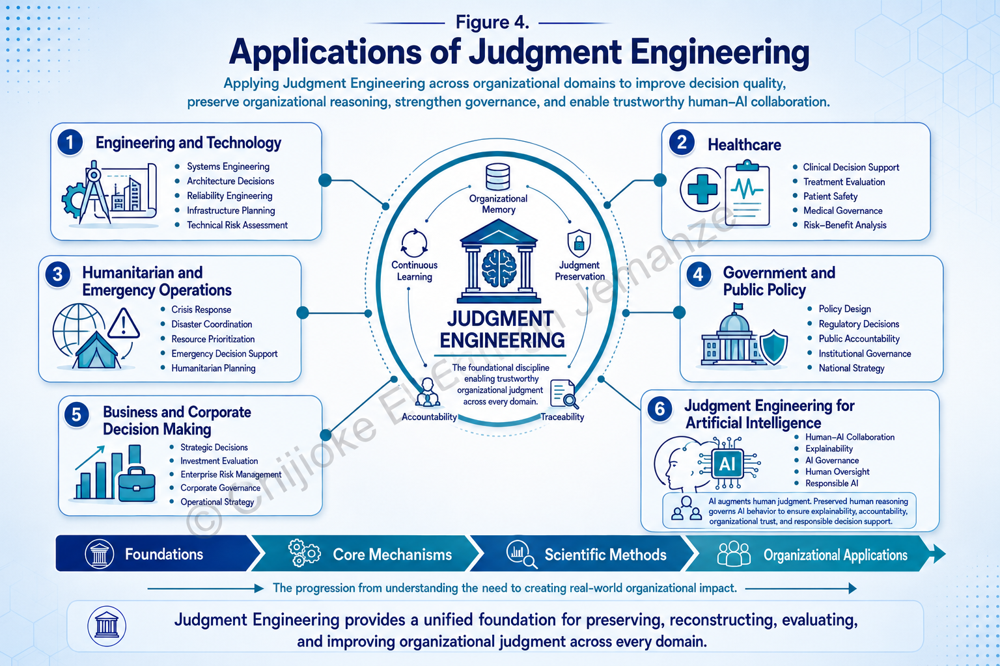
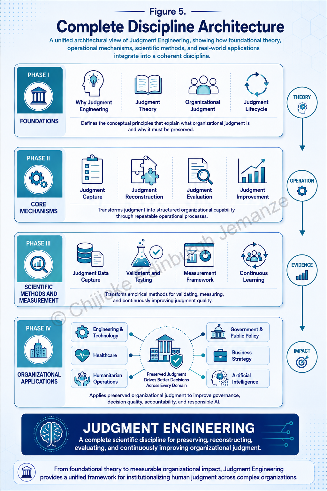

# Judgment Engineering

**Preserving Human Judgment as Organizational Memory for AI-Assisted Decision Making**

---

## Introduction

Organizations preserve decisions through documents, reports, emails, and databases. Yet the reasoning behind those decisions often disappears. As experienced professionals leave, organizations inherit outcomes but lose the judgment that produced them.

**Judgment Engineering** is an independent research initiative exploring how organizations can systematically capture, preserve, reconstruct, evaluate, and improve human judgment using structured methods and responsible AI.

Rather than preserving only **what** was decided, Judgment Engineering investigates how organizations can preserve **why** decisions were made, transforming human reasoning into a reusable organizational asset.

---

## Research Question

> **How can organizations capture, preserve, and continuously improve the reasoning behind important decisions instead of preserving only their outcomes?**

---

## Vision

To establish Judgment Engineering as a scientific and engineering discipline that enables organizations to preserve human judgment as searchable, reusable, and continuously improving organizational memory.

---

## Core Principles

Judgment Engineering is built upon four foundational principles:

- Preserve reasoning, not only decisions.
- Treat organizational judgment as a reusable asset.
- Use AI to structure and retrieve human reasoning without replacing human judgment.
- Improve future decisions through preserved organizational learning.

---

# Research Framework

The framework explores five interconnected areas:

- Judgment Capture
- Reasoning Preservation
- Organizational Memory
- AI-Assisted Retrieval
- Continuous Organizational Learning

Detailed framework:

**Framework/Research_Framework.md**

---

# Research Simulations

The project currently includes four research simulations demonstrating how preserved judgment improves organizational continuity.

### Current Simulations

- Network Operations Center Failure Response
- Engineering Decision Transfer
- Organizational Knowledge Loss
- AI-Assisted Decision Recovery

These simulations illustrate practical applications of Judgment Engineering across real operational environments.

---

# Visual Architecture

The repository includes publication-quality visual figures explaining the conceptual architecture of Judgment Engineering.

---

## Figure 1 — Foundations of Judgment Engineering

---

## Figure 2 — Core Mechanisms of Judgment Engineering

---

## Figure 3 — Methods and Measurement of Judgment Engineering

---

## Figure 4 — Applications of Judgment Engineering

---

## Figure 5 — Complete Discipline Architecture

---

# Repository Roadmap

## Completed

- ✅ Research Question
- ✅ Conceptual Framework
- ✅ White Paper (Book Manuscript)
- ✅ Four Research Simulations
- ✅ Visual Architecture
- ✅ System Architecture

## In Progress

- ⬜ Prototype Judgment Capture Platform
- ⬜ Judgment Repository
- ⬜ Open-source Reference Implementation

## Planned

- ⬜ Academic Paper Submission
- ⬜ Public Demonstration Platform
- ⬜ Organizational Pilot Studies

---

# Current Prototype

The first prototype demonstrates the complete Judgment Engineering lifecycle through four stages.

1. Capture organizational judgment.
2. Retrieve preserved reasoning.
3. Evaluate outcomes against assumptions.
4. Continuously improve future judgment.

The prototype is currently under active development.

---

# Research Contributions

Judgment Engineering introduces several foundational concepts, including:

- Judgment Units
- Judgment Capture
- Judgment Reconstruction
- Judgment Evaluation
- Judgment Improvement
- Organizational Judgment Lifecycle
- Judgment Preservation
- Judgment Residue
- Organizational Memory for AI

---

# Why This Research Matters

Organizations already preserve enormous amounts of information.

They rarely preserve the reasoning that produced it.

Judgment Engineering aims to make organizational judgment:

- Explainable
- Searchable
- Traceable
- Transferable
- Continuously improvable

This supports stronger governance, organizational resilience, responsible AI, and improved institutional learning.

---

# Contributing

Judgment Engineering is an open research initiative.

Researchers, engineers, knowledge management practitioners, AI researchers, organizational leaders, and students interested in advancing the discipline are welcome to contribute ideas, discussion, and constructive feedback.

---

# About

Judgment Engineering is an independent research initiative created by **Chijioke Edinburgh Jemanze**.

The work combines engineering practice, organizational learning, knowledge management, decision science, and artificial intelligence to investigate new methods for preserving human judgment as organizational memory.

---

# Contact

**Chijioke Edinburgh Jemanze**

LinkedIn

https://www.linkedin.com/in/chijioke-edinburgh-jemanze

GitHub

https://github.com/EdinburghRay-cell

Email

Edinburghray@gmail.com

---

## Citation

If you reference this work in research or professional publications, please cite this repository appropriately.

---

© 2026 Chijioke Edinburgh Jemanze. All Rights Reserved.