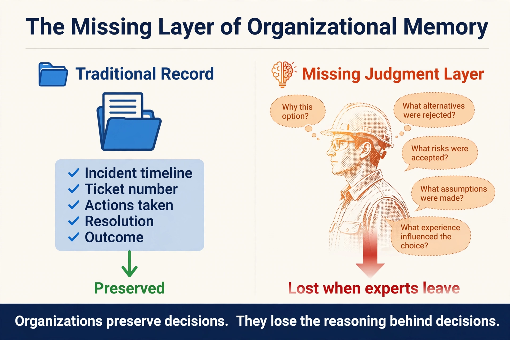
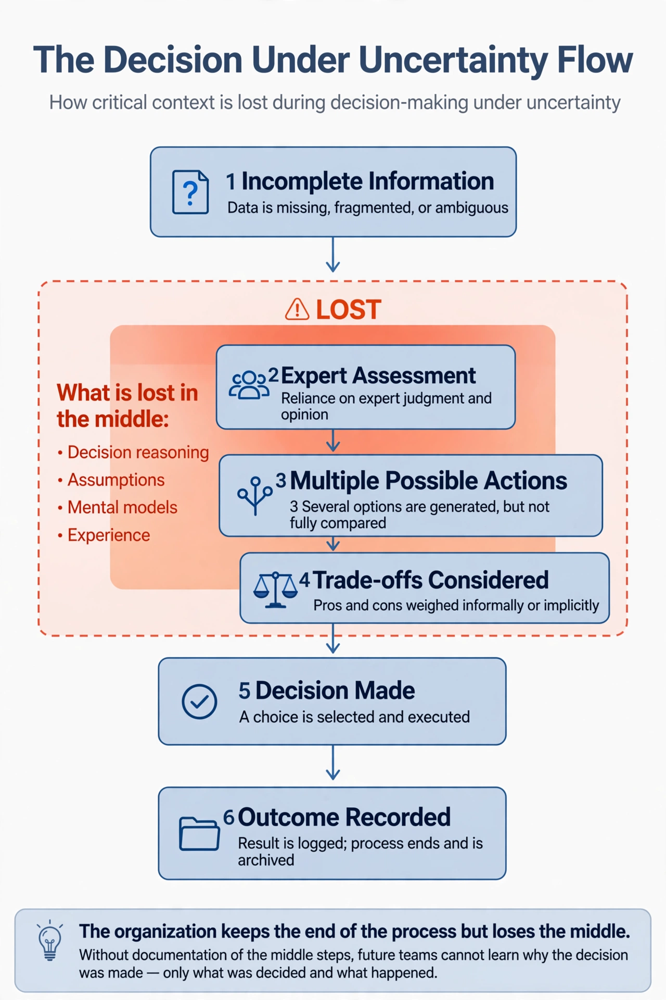

# Simulation 1 — The Loss

This simulation demonstrates how organizations preserve events while unintentionally losing the reasoning behind critical decisions.

## Visual 1A — The Missing Judgment Layer

## Visual 1B — Decision Under Uncertainty

