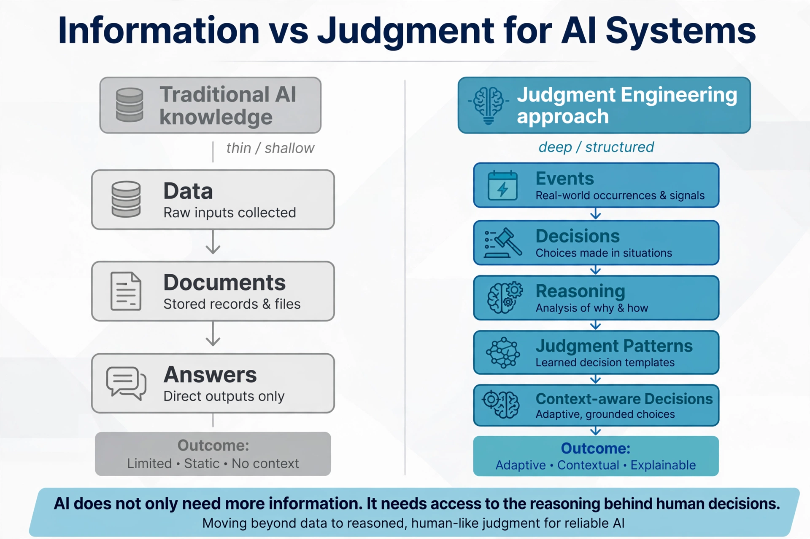

# Simulation 3 — The Transfer

This simulation demonstrates how preserved judgment can be transferred from one person to another, or from humans to AI-assisted systems. Rather than inheriting only historical records, future decision makers inherit the reasoning that guided earlier decisions.

## Visual 3A — Human Decision to AI-Structured Judgment

This visual illustrates how human expertise is transformed into a structured judgment record that AI systems can organize, retrieve, and support without replacing human judgment.

## Visual 3B — Information vs. Judgment for AI

This visual contrasts information preservation with judgment preservation, showing why AI systems become more useful when they can access structured human reasoning instead of isolated facts alone.
