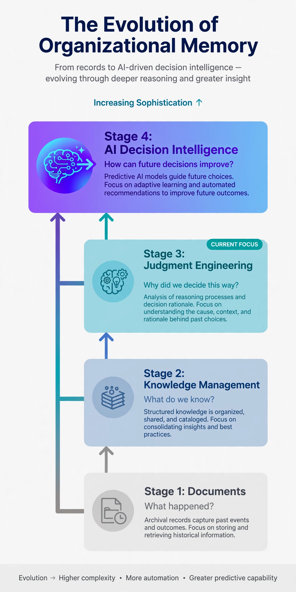
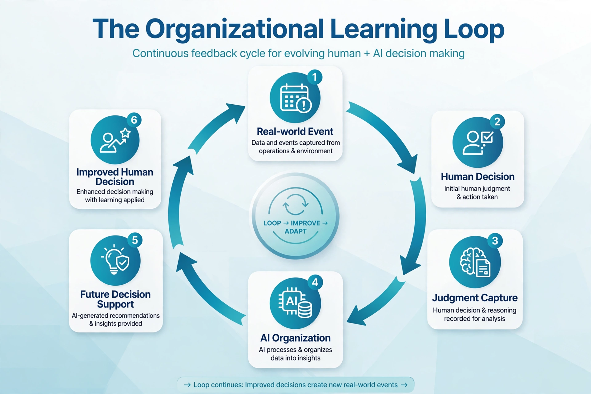

# Simulation 4 — The Institution

This simulation demonstrates how Judgment Engineering becomes an organizational capability. Rather than depending solely on individual expertise, organizations systematically preserve, retrieve, evaluate, and improve judgment as part of their normal operations.

## Visual 4A — Evolution of Organizational Memory

This visual illustrates how organizations evolve from preserving isolated documents and information to preserving structured judgment, transforming experience into reusable organizational memory.

---

## Visual 4B — Organizational Learning Loop

This visual demonstrates how preserved judgment creates a continuous organizational learning cycle. As decisions are captured, evaluated, refined, and reused, organizational memory becomes stronger over time, enabling better future decisions and more resilient institutions..
